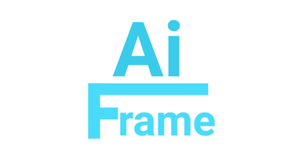

     
    <strong>A lightweight framework for Neural Networks and AI</strong>  
    
    
    

## 1. 📖 About

AIFrame aims to be a **lightweight framework** written in pure Python and accelerated by **OpenCL** and **Numpy**.
This repository is a clean and more well-written version than the actual prototype that isn't available for public use.

**Currently, the project is under development and will need some time to be actually used!**

## 2. 🔧 Features (planned)

- ✨ Simplicity for fast prototyping
- 🏎️ Speed and performance for low-end hardware (CPU & GPU support)
- 💻 Training pipelines for easy training
- 📄 Buildscripts for automated use
- 🔌 Low-level access for custom logic
- 💾 Custom file format
- 🗺️ Adaption for other file formats
